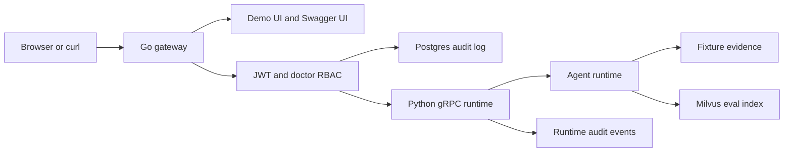
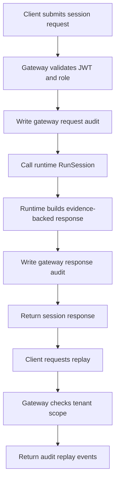
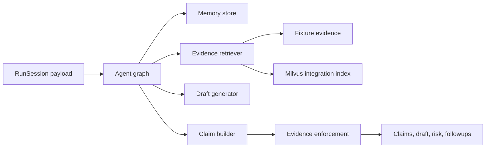
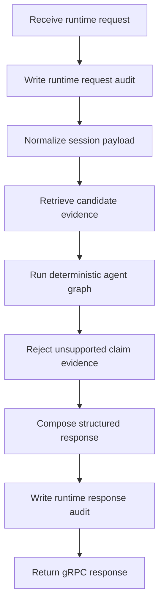

<p align="center">
  
</p>

<p align="center">
  An open-source clinical triage project for medication-safety workflows, evidence-backed agent responses, and auditable gateway/runtime orchestration.
</p>

<p align="center">
  <a href="https://github.com/LeeJc02/MedOrbit/actions/workflows/ci.yml"></a>
  <a href="https://github.com/LeeJc02/MedOrbit/actions/workflows/release.yml"></a>
  <a href="https://github.com/LeeJc02/MedOrbit/blob/main/LICENSE"></a>
  <a href="https://github.com/LeeJc02/MedOrbit/pkgs/container/medorbit-gateway"></a>
  <a href="https://github.com/LeeJc02/MedOrbit/stargazers"></a>
</p>

<p align="center">
  <a href="./README.zh-CN.md">中文说明</a>
</p>

## Overview

MedOrbit is a production-shaped demo for drug interaction triage and medication-safety workflows. The repository ships a Go HTTP gateway, a Python gRPC runtime, tenant-scoped audit replay, OpenAPI documentation, and an evaluation harness for evidence quality checks.

The public project name is MedOrbit. The repository still keeps `ddi` as an internal compatibility identifier for the Go module, protobuf package, environment variables, generated stubs, and local database defaults.

This project focuses on the parts that make clinical agent systems interesting:

- JWT authentication and doctor-role RBAC before protected gateway operations
- a Go gateway that owns HTTP APIs, OpenAPI docs, static UI delivery, and audit writes
- a Python runtime that returns evidence-backed claims, draft text, risk level, and follow-up questions
- same-tenant audit replay for gateway and runtime events
- offline and Docker-backed evals for agent quality gates
- containerized delivery with tag-triggered binaries and GHCR images

## Highlights

- **Evidence-first runtime**: generated claims are forced through an evidence enforcement step before returning to the gateway.
- **Auditable request path**: session runs and replay calls are scoped by tenant and backed by gateway audit records.
- **Small service boundary**: the gateway and runtime stay separate without turning the demo into a sprawling microservice stack.
- **Production-shaped workflow**: CI, smoke tests, eval thresholds, Dockerfiles, and release artifacts are part of the repository.
- **Local-first experience**: the included UI, Swagger page, scripts, and Docker Compose dependencies make the stack easy to inspect on one machine.

## Architecture

### Services

- `gateway`: Go HTTP service for UI/static assets, OpenAPI, JWT/RBAC middleware, session APIs, and Postgres audit logging
- `runtime`: Python gRPC service for retrieval, agent graph execution, evidence enforcement, runtime audit events, and health checks
- `docker-compose.yml`: local dependency stack for Postgres, etcd, MinIO, and Milvus

### Project architecture



### Data and state

- `Postgres`: durable gateway audit log and tenant-scoped replay source
- `Runtime audit logger`: in-memory runtime events used by local replay responses
- `Fixture evidence`: deterministic local corpus for tests and offline evals
- `Milvus`: optional vector index used by the Docker-backed integration eval

### Request path

1. A browser or curl client calls `POST /v1/session/run` with an HS256 JWT.
2. The gateway validates required claims and the `doctor` role.
3. The gateway writes `gateway.request`, calls the Python runtime over gRPC, then writes `gateway.response`.
4. The runtime retrieves evidence, builds claims, enforces citations, and returns a structured response.
5. `POST /v1/session/replay` reads same-tenant audit events for replay.

### Project flow



## Agent Runtime

### Agent architecture



### Agent flow



## Tech Stack

| Layer | Stack |
| --- | --- |
| Gateway | Go 1.23, Gin, pgx, gRPC client |
| Runtime | Python 3.12, gRPC, Pydantic |
| Data | Postgres audit log, Milvus integration eval index |
| API | OpenAPI 3.0, Swagger UI, protobuf |
| Evaluation | pytest, offline evals, Docker-backed integration evals |
| Delivery | Docker, GitHub Actions, GHCR, GitHub Releases |

## Repository Layout

```text
.
├── cmd/gateway/       # Go gateway entrypoint
├── internal/          # gateway config, middleware, handlers, audit, runtime client
├── python/runtime/    # Python gRPC runtime, agent graph, tests, evals
├── openapi/           # public HTTP API contract
├── web/               # demo UI and Swagger UI shell
├── assets/            # public logo and favicon
├── docker/            # gateway and runtime Dockerfiles
├── scripts/           # local setup, protobuf generation, smoke tests
├── sql/               # audit schema
└── .github/workflows/ # CI and release pipelines
```

Brand assets for the public repository live in `assets/`, so GitHub previews, the web UI, and packaged gateway images use the same logo set.

## Local Development

Install Python dependencies in your runtime/test environment:

```bash
conda run -n ddi-agent python -m pip install -r python/runtime/requirements.txt
```

Start the local stack:

```bash
make run-local
```

Run the smoke check:

```bash
make e2e-smoke
```

Default endpoints:

- Demo UI: `http://localhost:8080`
- Swagger UI: `http://localhost:8080/docs`
- Gateway API: `http://localhost:8080/v1/session/run`
- Runtime gRPC: `127.0.0.1:50051`

## API and Authentication

Protected HTTP routes require an HS256 JWT signed with `DDI_JWT_SECRET`.

Required claims:

- `sub` or `user_id`
- `tenant_id`
- `roles`, including `doctor`
- `exp`

The local demo UI signs a doctor-role token with the development secret `dev-secret`. Use a different secret for any non-local deployment.

## Run from GHCR

MedOrbit publishes gateway and runtime images to GHCR when a `v*` tag is pushed.

```bash
docker pull ghcr.io/leejc02/medorbit-gateway:latest
docker pull ghcr.io/leejc02/medorbit-runtime:latest
```

Build local images:

```bash
docker build -f docker/gateway.Dockerfile -t medorbit-gateway:local .
docker build -f docker/runtime.Dockerfile -t medorbit-runtime:local .
```

Published images:

- `ghcr.io/leejc02/medorbit-gateway`
- `ghcr.io/leejc02/medorbit-runtime`

## Verification

```bash
go test ./...
conda run -n ddi-agent python -m pytest python/runtime/tests -q
conda run -n ddi-agent python -m evals.run_agent_eval --mode offline --fail-on-threshold
DDI_EVAL_INTEGRATION=1 conda run -n ddi-agent python -m evals.run_agent_eval --mode integration --fail-on-threshold
./scripts/e2e_smoke.sh
```

## Release

Pushing a `v*` tag runs the release workflow, creates a GitHub Release, uploads gateway binaries, and publishes gateway/runtime images.

```bash
git tag v0.1.0
git push origin v0.1.0
```

Release binaries are built for `linux-amd64`, `linux-arm64`, `darwin-amd64`, and `darwin-arm64`.

## Roadmap

- add richer deployment examples around the gateway/runtime split
- expand the evidence corpus and evaluation cases
- continue hardening audit replay and observability workflows

## Security

- Do not use the default `dev-secret` outside local development.
- Keep `.env`, certificates, keys, tokens, and generated eval reports out of Git.
- This demo is not a medical device and should not be used for real clinical decision-making without independent validation, governance, and compliance review.

## Contributing

Issues, ideas, clinical workflow suggestions, and pull requests are welcome. If you build on top of MedOrbit, I would be interested to see it.

## License

This project is released under the [MIT License](./LICENSE).
