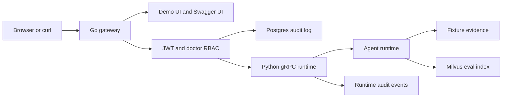
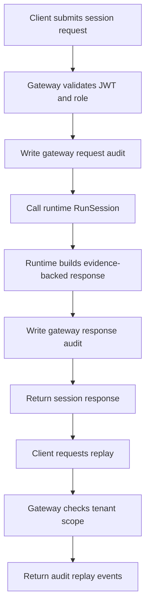
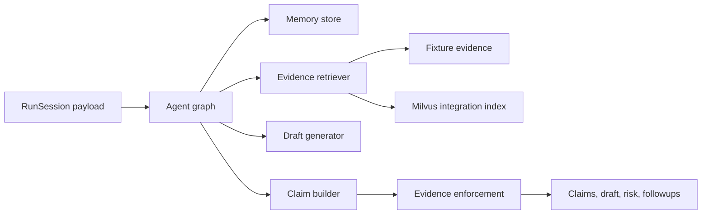
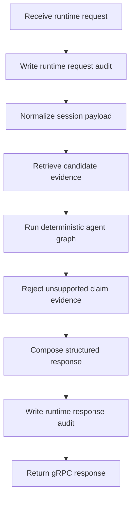

<p align="center">
  
</p>

<p align="center">
  面向用药安全流程、证据约束 agent 响应和可审计 gateway/runtime 编排的开源临床分诊项目。
</p>

<p align="center">
  <a href="https://github.com/LeeJc02/MedOrbit/actions/workflows/ci.yml"></a>
  <a href="https://github.com/LeeJc02/MedOrbit/actions/workflows/release.yml"></a>
  <a href="https://github.com/LeeJc02/MedOrbit/blob/main/LICENSE"></a>
  <a href="https://github.com/LeeJc02/MedOrbit/pkgs/container/medorbit-gateway"></a>
</p>

<p align="center">
  <a href="./README.md">English</a>
</p>

## 项目概览

MedOrbit 是一个面向药物相互作用分诊和用药安全流程的工程化演示项目。仓库包含 Go HTTP gateway、Python gRPC runtime、同租户审计回放、OpenAPI 文档，以及用于证据质量检查的评测工具。

对外项目名称是 MedOrbit。仓库内部仍保留 `ddi` 作为兼容标识，用于 Go module、protobuf package、环境变量、生成代码和本地数据库默认值。

这个项目重点覆盖临床 agent 系统里更有价值的部分：

- 受 JWT 和医生角色 RBAC 保护的 gateway 操作
- 负责 HTTP API、OpenAPI、静态 UI 和审计写入的 Go gateway
- 返回证据约束 claims、草稿、风险等级和追问的 Python runtime
- gateway 和 runtime 事件的同租户审计回放
- 离线评测和 Docker 依赖服务下的集成评测
- 基于 Docker、GitHub Release 和 GHCR 的发布路径

## 核心亮点

- **证据优先的 runtime**：claims 返回前必须经过证据约束处理。
- **可审计请求链路**：session run 和 replay 都按 tenant 隔离，并由 gateway 审计记录支撑。
- **克制的服务边界**：gateway 与 runtime 独立，但不把演示系统拆成过度复杂的微服务。
- **工程化工作流**：CI、冒烟测试、评测阈值、Dockerfile 和 release artifact 都已纳入仓库。
- **本地优先体验**：内置 UI、Swagger 页面、脚本和 Docker Compose 依赖，便于单机检查完整流程。

## 架构

### 服务

- `gateway`：Go HTTP 服务，负责 UI/静态资源、OpenAPI、JWT/RBAC、session API 和 Postgres 审计写入
- `runtime`：Python gRPC 服务，负责检索、agent graph、证据约束、runtime 审计事件和健康检查
- `docker-compose.yml`：本地 Postgres、etcd、MinIO、Milvus 依赖栈

### 项目架构



### 数据和状态

- `Postgres`：持久化 gateway 审计日志，也是同租户 replay 的数据源
- `Runtime audit logger`：本地 runtime 事件，用于 replay 响应
- `Fixture evidence`：测试和离线评测使用的确定性证据语料
- `Milvus`：Docker-backed 集成评测使用的可选向量索引

### 请求链路

1. 浏览器或 curl 携带 HS256 JWT 调用 `POST /v1/session/run`。
2. Gateway 校验必需 claims 和 `doctor` 角色。
3. Gateway 写入 `gateway.request`，通过 gRPC 调用 Python runtime，然后写入 `gateway.response`。
4. Runtime 检索证据、构建 claims、执行引用约束，并返回结构化响应。
5. `POST /v1/session/replay` 读取同租户审计事件。

### 项目流程



## Agent Runtime

### Agent 架构



### Agent 流程



## 技术栈

| 层级 | 技术 |
| --- | --- |
| Gateway | Go 1.23, Gin, pgx, gRPC client |
| Runtime | Python 3.12, gRPC, Pydantic |
| 数据 | Postgres audit log, Milvus integration eval index |
| API | OpenAPI 3.0, Swagger UI, protobuf |
| 评测 | pytest, offline evals, Docker-backed integration evals |
| 交付 | Docker, GitHub Actions, GHCR, GitHub Releases |

## 仓库结构

```text
.
├── cmd/gateway/       # Go gateway 入口
├── internal/          # gateway 配置、中间件、handler、审计、runtime client
├── python/runtime/    # Python gRPC runtime、agent graph、测试、评测
├── openapi/           # public HTTP API contract
├── web/               # demo UI 和 Swagger UI shell
├── assets/            # public logo 和 favicon
├── docker/            # gateway/runtime Dockerfile
├── scripts/           # 本地初始化、protobuf 生成、冒烟测试
├── sql/               # 审计表结构
└── .github/workflows/ # CI 和 release pipeline
```

公共品牌资源放在 `assets/`，GitHub 预览、Web UI 和 gateway 镜像使用同一套 logo。

## 本地开发

安装 Python 依赖：

```bash
conda run -n ddi-agent python -m pip install -r python/runtime/requirements.txt
```

启动本地服务：

```bash
make run-local
```

运行冒烟测试：

```bash
make e2e-smoke
```

默认端点：

- Demo UI: `http://localhost:8080`
- Swagger UI: `http://localhost:8080/docs`
- Gateway API: `http://localhost:8080/v1/session/run`
- Runtime gRPC: `127.0.0.1:50051`

## API 和鉴权

受保护 HTTP 路由需要使用 `DDI_JWT_SECRET` 签名的 HS256 JWT。

必需 claims：

- `sub` 或 `user_id`
- `tenant_id`
- `roles`，包含 `doctor`
- `exp`

本地演示 UI 会用开发密钥 `dev-secret` 生成 doctor-role token。非本地环境必须更换密钥。

## GHCR 镜像

推送 `v*` tag 后，MedOrbit 会发布 gateway 和 runtime 镜像到 GHCR。

```bash
docker pull ghcr.io/leejc02/medorbit-gateway:latest
docker pull ghcr.io/leejc02/medorbit-runtime:latest
```

本地构建镜像：

```bash
docker build -f docker/gateway.Dockerfile -t medorbit-gateway:local .
docker build -f docker/runtime.Dockerfile -t medorbit-runtime:local .
```

发布镜像：

- `ghcr.io/leejc02/medorbit-gateway`
- `ghcr.io/leejc02/medorbit-runtime`

## 验证

```bash
go test ./...
conda run -n ddi-agent python -m pytest python/runtime/tests -q
conda run -n ddi-agent python -m evals.run_agent_eval --mode offline --fail-on-threshold
DDI_EVAL_INTEGRATION=1 conda run -n ddi-agent python -m evals.run_agent_eval --mode integration --fail-on-threshold
./scripts/e2e_smoke.sh
```

## 发布

推送 `v*` tag 会触发 release workflow，创建 GitHub Release，上传 gateway 多平台二进制，并发布 gateway/runtime 镜像。

```bash
git tag v0.1.0
git push origin v0.1.0
```

Gateway 二进制覆盖 `linux-amd64`、`linux-arm64`、`darwin-amd64` 和 `darwin-arm64`。

## 路线图

- 增加 gateway/runtime 拆分下的部署示例
- 扩充证据语料和评测 case
- 继续增强审计回放和可观测性流程

## 安全

- 非本地环境不要使用默认 `dev-secret`。
- `.env`、证书、密钥、token 和生成的评测报告不应提交到 Git。
- 该项目不是医疗器械；真实临床使用前需要独立验证、治理和合规审查。

## 贡献

欢迎提交 issue、想法、临床流程建议和 pull request。如果你基于 MedOrbit 做了扩展，我也很愿意了解。

## 许可证

本项目使用 [MIT License](./LICENSE) 发布。
